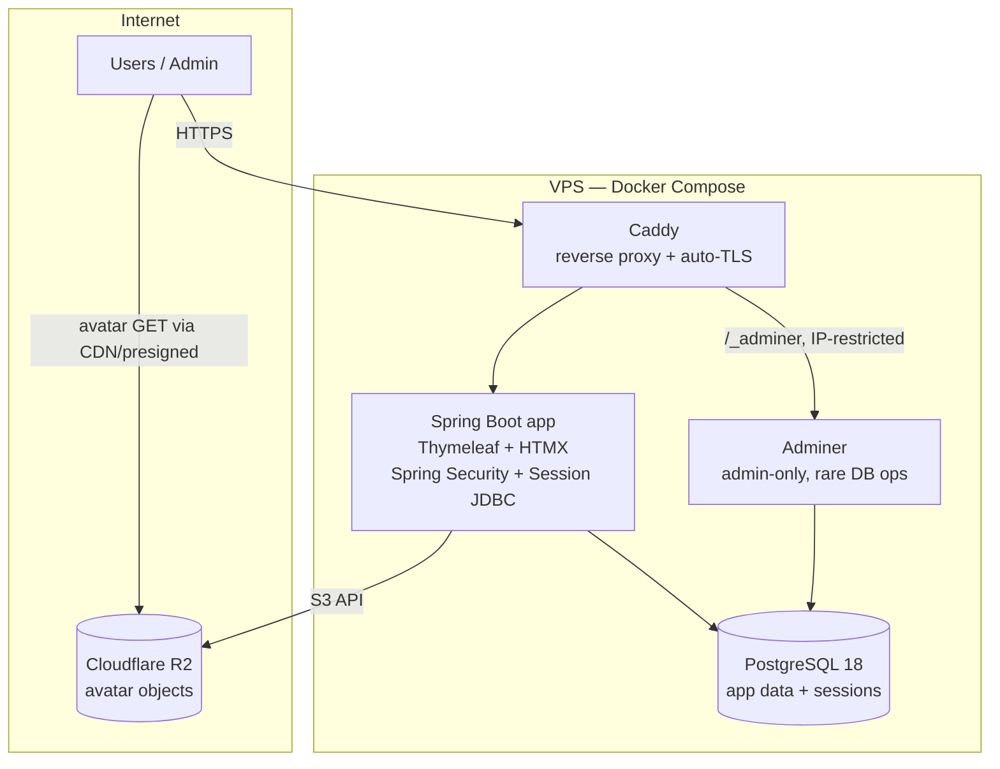

# Architecture v1

**Project:** Life Experience Discovery Portal
**Stack:** Spring Boot (Java) + Thymeleaf/HTMX, PostgreSQL, VPS + Docker Compose.
**Aligned with:** `MVP_SCOPE_v3_decisions.md`, `Life_Experience_Portal_Context_v3.md`, `data_model_v1.md`, `schema.sql`.
**Date:** 2026-05-22

---

## 1. Stack decisions (S1–S9)

| # | Area | Decision |
|---|---|---|
| S1 | Archetype | Spring Boot + Thymeleaf + HTMX (server-rendered, Java). |
| S2 | Schema source of truth | SQL-first: `schema.sql` is the canonical DDL, shipped as Flyway `V1`. JDBC models mirror it. |
| S3 | Hosting | Single VPS, Docker Compose. |
| S4 | Migrations | Flyway (versioned SQL files). |
| S5 | Data access | Spring Data JDBC (aggregate model, no JPA/Hibernate). |
| S6 | Sessions | Spring Session JDBC (sessions persisted in Postgres). |
| S7 | Admin | Lean: role-gated in-app actions (`is_admin`) + Adminer container for rare DB ops / password reset. |
| S8 | Avatars | Cloudflare R2 (S3-compatible); store object key in `users.avatar_url`. |
| S9 | UUIDv7 | DB-side via built-in `uuidv7()` (PostgreSQL 18+); app inserts NULL id. |

---

## 2. Deployment (single VPS, Docker Compose)



Containers: `caddy`, `app`, `db` (PostgreSQL 18, uuidv7() built-in), `adminer`. Avatars live outside the VPS in R2, so a VPS rebuild does not lose user images.

---

## 3. Project structure (Maven, package-by-feature)

```
pom.xml
docker-compose.yml
Caddyfile
docker/
  app.Dockerfile          # multi-stage: build jar, run on JRE
  db.Dockerfile           # postgres:18 (uuidv7() built-in)
src/main/java/com/lep/portal/
  PortalApplication.java
  config/                 # SecurityConfig, SessionConfig, R2Config, WebConfig
  common/                 # base aggregate, AggregateReference helpers, errors, time
  user/                   # User aggregate, repo, service, controllers, forms
  invite/                 # Invite aggregate + invite-gated registration flow
  catalog/                # Category, Activity, Variant, Tag (+ join links)
  experience/             # UserExperience, Bookmark
  admin/                  # role-gated controllers (edit/archive/block, tag normalize)
src/main/resources/
  application.yml
  db/migration/
    V1__init.sql          # = schema.sql
    V2__spring_session.sql# Spring Session JDBC DDL (PostgreSQL)
  templates/              # Thymeleaf (fragments + pages)
  static/                 # css, htmx, minimal js
src/test/java/...         # repository (Testcontainers PG), service, web slice tests
```

---

## 4. Data access — Spring Data JDBC (S5) notes

- **Aggregates by id, not object graphs.** Each table is an aggregate root with `@Id UUID id`. Cross-aggregate links use `AggregateReference<T, UUID>` (or a plain `UUID` column). No lazy loading; load aggregates explicitly and compose in services.
- **UUID generation (S9).** `id` is `NULL` in the entity on insert → Spring Data JDBC treats the row as new → DB `DEFAULT uuidv7()` generates it → the generated key is read back. This sidesteps the `Persistable.isNew()` ambiguity that arises with app-side ids.
- **m2m tags (D6).** `activity_tags` / `variant_tags` are modeled as **owned collections inside the Activity/Variant aggregate** via `@MappedCollection` (each row references a Tag by id). Tag normalization stays in the Tag service. Alternative: manage join rows through explicit repository methods if aggregate ownership feels heavy.
- **Soft delete + visibility (D2/D7).** No ORM cascade. Repositories query the `visible_activities` / `visible_variants` views (or replicate the predicate) for catalog reads. Status transitions are explicit service operations.
- **Timestamps (created_at / updated_at).** Managed by Spring Data JDBC Auditing (`@EnableJdbcAuditing` + `@CreatedDate` / `@LastModifiedDate`). The application owns timestamps; DB triggers have been dropped (V3). Column DEFAULTs are kept as a DB-level safety net.
- **Testing.** Repository tests run against real Postgres via Testcontainers (the schema relies on PG-specific features: `NULLS NOT DISTINCT`, composite FK, built-in `uuidv7()`). H2 is not viable.

---

## 5. Migrations (S2/S4)

- Flyway runs on app startup against the `db/migration` files.
- `V1__init.sql` is a copy of the validated `schema.sql` (uuidv7() is built-in PG 18+, no extension needed).
- `V2__spring_session.sql` adds the Spring Session JDBC tables (`SPRING_SESSION`, `SPRING_SESSION_ATTRIBUTES`) using Spring's bundled PostgreSQL DDL.
- `V3__remove_timestamp_triggers.sql` drops `set_updated_at()` and all its triggers. Timestamps are now set by the application via JDBC Auditing.

---

## 6. Security (auth decisions + S6/S7)

- **Spring Security 6**, form login at `/login`. Authentication = email + password.
- **Hashing:** `Argon2PasswordEncoder` (argon2id) from `spring-security-crypto`.
- **Authorities:** derived from `users.is_admin` (`ROLE_ADMIN` vs `ROLE_USER`). Admin routes/actions are role-gated (S7).
- **Sessions:** Spring Session JDBC (S6) — survive app redeploys; logout/expiry invalidate server-side.
- **CSRF:** enabled; Thymeleaf forms carry the token. HTMX requests send the CSRF header.
- **Registration:** invite-gated — validate code exists, not expired (`expires_at`), not revoked, before creating the user; set `invited_by_user_id` + `invite_id` + `consent_at`.
- **Brute-force:** login rate-limit / lockout required (e.g. bucket4j or a failed-attempt counter). Lib choice = open item.
- **Admin reset (S7):** admin sets a new `password_hash` via Adminer or an admin action; no email infra.

---

## 7. Avatars — Cloudflare R2 (S8)

- AWS SDK v2 S3 client pointed at the R2 endpoint (S3-compatible).
- On upload: validate content-type + max size, resize to fixed dimensions (imgscalr / Thumbnailator), store under a key like `avatars/{user_id}`.
- Persist the object key/URL in `users.avatar_url`.
- Serve via a public bucket behind Cloudflare CDN, or via presigned GET URLs. Public-bucket + CDN is simpler for an all-visible MVP.

---

## 8. Configuration (12-factor)

- All secrets/endpoints via env vars (`SPRING_DATASOURCE_*`, `R2_*`, `APP_*`). No secrets in the image.
- Spring profiles: `default`/`prod`; `application.yml` reads env with sane local fallbacks.
- Reverse proxy: **Caddy** (automatic TLS) recommended over nginx for solo simplicity.

---

## 9. Open items (implementation-time; non-blocking)

1. `complexity_level` set — proposed `{low, medium, high}`; confirm.
2. `estimated_duration` format — free text now; structure later if duration filtering is wanted.
3. Soft-deleted email uniqueness — recommend a **partial unique** index on `email WHERE deleted_at IS NULL` to allow re-registration after account removal. (Currently global unique.)
4. Brute-force lib — bucket4j vs hand-rolled attempt counter.
5. ~~`pg_uuidv7` image build~~ — resolved: PostgreSQL 18 has built-in `uuidv7()`. No extension build needed.
6. Reverse proxy — Caddy (recommended) vs nginx.

---

## 10. Next steps (implementation files session)

1. Confirm open items 1–3 (schema-touching) before generating migrations.
2. Generate: `pom.xml`, `docker-compose.yml` (+ `app.Dockerfile`, `db.Dockerfile`, `Caddyfile`), Flyway `V1/V2`, config classes, aggregates + repositories, auth flow, catalog CRUD, admin actions, Thymeleaf templates, Testcontainers tests.
3. Wire CI (build + test) — fits the existing Docker/CI-CD experience.
