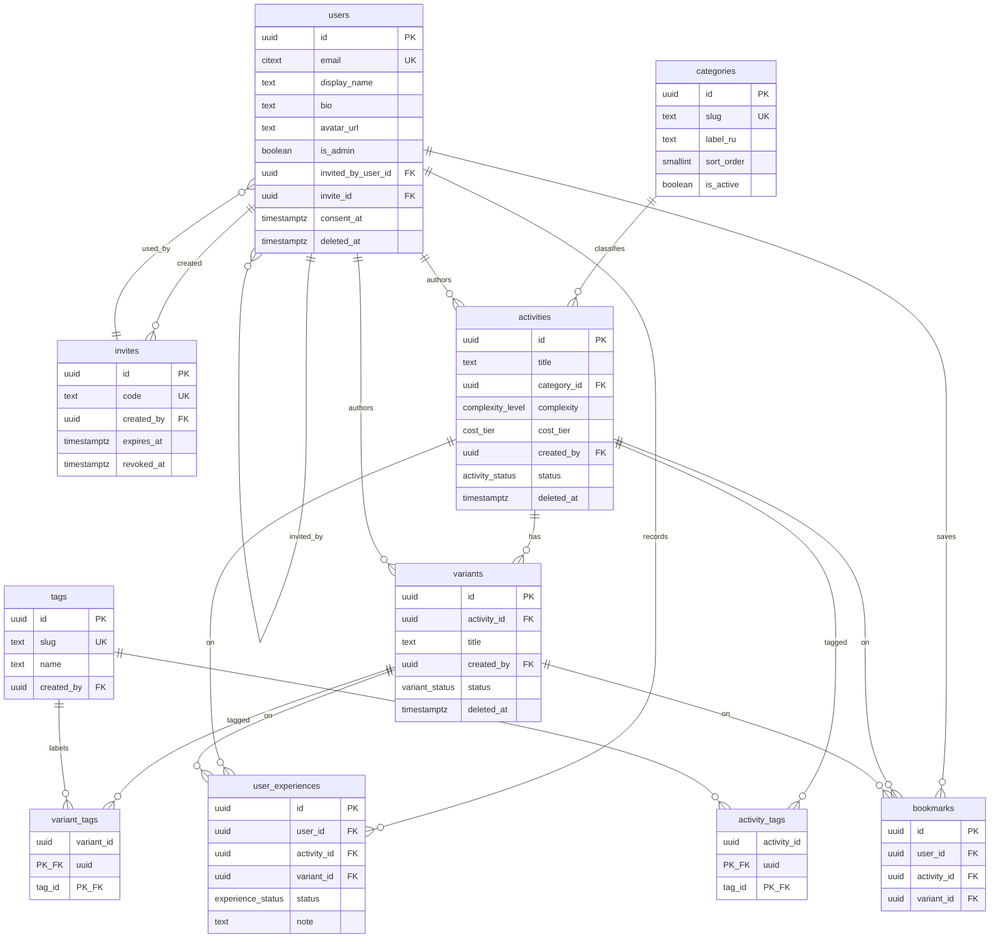

# Data Model v1

**Project:** Life Experience Discovery Portal
**Engine:** PostgreSQL 18 (uses `UNIQUE NULLS NOT DISTINCT`; `uuidv7()` built-in).
**Canonical DDL:** `schema.sql` (runnable). This doc = reference + rationale.
**Validated:** loads on PG18 and passes invariant tests T1–T6.
**Date:** 2026-05-22

---

## 1. Decision recap (D0–D8)

| # | Decision |
|---|---|
| D0 | PostgreSQL. |
| D1 | UUIDv7 primary keys (non-enumerable, time-ordered). |
| D2 | `status` enum = lifecycle source of truth; `deleted_at` = soft-delete tombstone; **no** `archived_at`. Visible = `status='ACTIVE' AND deleted_at IS NULL`. |
| D3 | Native PG ENUM for internal states; `categories` is a seeded lookup table (RU labels). |
| D4 | `UNIQUE NULLS NOT DISTINCT (user_id, activity_id, variant_id)` on `user_experiences` and `bookmarks`. |
| D5 | Bookmark mirrors UserExperience: `activity_id NOT NULL` + nullable `variant_id`; composite FK `(variant_id, activity_id) → variants(id, activity_id)` guarantees the variant belongs to the activity. |
| D6 | Two join tables: `activity_tags`, `variant_tags`. |
| D7 | Query-time visibility (views), no cascade writes. FK `ON DELETE RESTRICT` for content refs; `CASCADE` for user-owned rows and tag links. |
| D8 | `users.invited_by_user_id` + `users.invite_id` (both nullable). |

---

## 2. ERD

---

## 3. Tables (summary)

| Table | Purpose | Key columns / notes |
|---|---|---|
| `users` | Accounts. | `email` + `password_hash` (argon2id, NOT NULL); admin-assisted reset; no email verification in MVP; `is_admin`, `invited_by_user_id`, `invite_id`, `consent_at`, soft delete. |
| `invites` | Invite codes. | Reusable, `expires_at` = created+7d (set in app), `revoked_at`. |
| `categories` | Fixed RU taxonomy. | Seeded 9 rows; runtime-immutable; `slug` internal, `label_ru` display. |
| `activities` | Core "what to try". | `cost_tier`/`complexity` enums, `estimated_duration` free text, `status`, soft delete. Index on `lower(title)` for dup-check. |
| `variants` | "How to try differently". | `UNIQUE(id, activity_id)` anchors child composite FKs. Created `ACTIVE`. |
| `tags` | User-creatable labels. | `slug` = normalized `lower(trim(name))`, unique. |
| `activity_tags` / `variant_tags` | m2m tag links. | Composite PK; `ON DELETE CASCADE`. |
| `user_experiences` | Intent/outcome per (user, activity[, variant]). | One mutable row; `status` changes in place; `UNIQUE NULLS NOT DISTINCT`. |
| `bookmarks` | Save-for-later, separate from statuses. | Same target shape and uniqueness as `user_experiences`. |

ENUM types: `activity_status` (DRAFT/ACTIVE/ARCHIVED/BLOCKED), `variant_status` (DRAFT/ACTIVE/ARCHIVED), `experience_status` (INTERESTING/WANT_TO_TRY/TRIED/WANT_REPEAT), `cost_tier` (free/low/mid/high), `complexity_level` (low/medium/high — see Open).

---

## 4. Invariants & query rules

- **Visibility (D7):** an Activity is visible iff `status='ACTIVE' AND deleted_at IS NULL`. A Variant is visible iff it is ACTIVE/not-deleted **and** its parent Activity is visible. Encoded in views `visible_activities` / `visible_variants`. Archiving/blocking a parent hides children with **no writes** to children (reversible). *Verified T5.*
- **Independent grain (D4):** a user may hold an activity-level row (`variant_id IS NULL`) and variant-level rows simultaneously; duplicates at each level are blocked by `NULLS NOT DISTINCT`. *Verified T1–T3.*
- **Target consistency (D5):** when `variant_id` is set, the composite FK guarantees it belongs to `activity_id`. When `variant_id IS NULL`, only the direct `activity_id` FK applies. *Verified T4.*
- **Soft delete (D2):** content is never hard-deleted in-app; `deleted_at` is the tombstone, `status` carries lifecycle. Hard deletes are admin DB ops; content FKs are `ON DELETE RESTRICT` to force explicit handling.
- **User-owned rows:** `user_experiences` / `bookmarks` are mutable user state, `ON DELETE CASCADE` on `user_id`; un-marking/un-saving = row delete (no soft delete here).
- **Dup-check (warning, non-blocking):** on Activity create, look up `lower(title)` match (indexed) → surface a warning; no DB-level uniqueness on title.
- **Tag hygiene:** normalize to `slug = lower(trim(name))` before insert; `slug` unique suppresses duplicates; display `name` preserved.
- **Timestamps:** `created_at` and `updated_at` are managed by the application via Spring Data JDBC Auditing (`@CreatedDate` / `@LastModifiedDate`). DB triggers have been dropped (V3 migration). Column DEFAULTs remain as a DB-level fallback.

---

## 5. Open items (carry into stack + later sessions)

**Auth (resolved):** email + password, hashed with **argon2id**, `password_hash NOT NULL`. **Admin-assisted reset** — no transactional email infra in MVP. Email verification skipped (invite-only trust). Login requires rate-limit / lockout against brute-force & credential stuffing.

**Resolved at stack session:** UUIDv7 → DB-side built-in `uuidv7()` (PostgreSQL 18+). Sessions → Spring Session JDBC (Postgres). Avatars → Cloudflare R2 (key in `users.avatar_url`). Timestamps → Spring Data JDBC Auditing. See `architecture_v1.md`.

1. **`complexity_level` set** — confirm `{low, medium, high}` or switch to `{beginner, intermediate, advanced}`.
2. **`estimated_duration` format** — free text now; consider structured (min/max minutes) if filtering by duration is wanted.
3. **Soft-deleted email uniqueness** — `email` is globally unique; recommend a partial unique index on `email WHERE deleted_at IS NULL` to allow re-registration after removal.

---

## 6. Next steps

1. Architecture + stack (framework, ORM/migrations, password hashing lib, session store, avatar storage, hosting).
2. Generate implementation files (migrations from `schema.sql`, models, repositories, auth flow).
